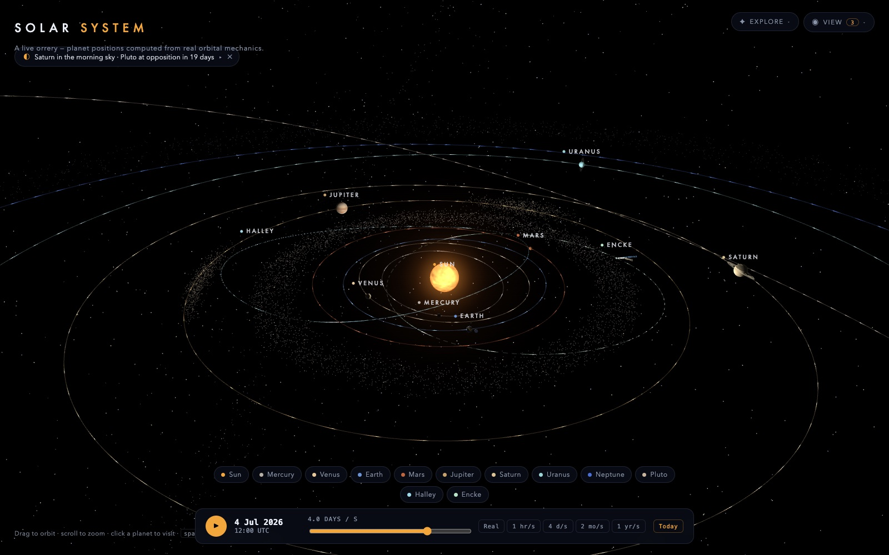
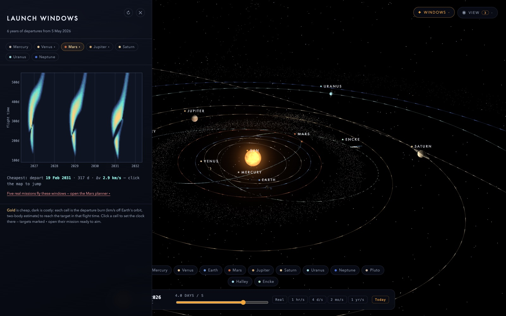
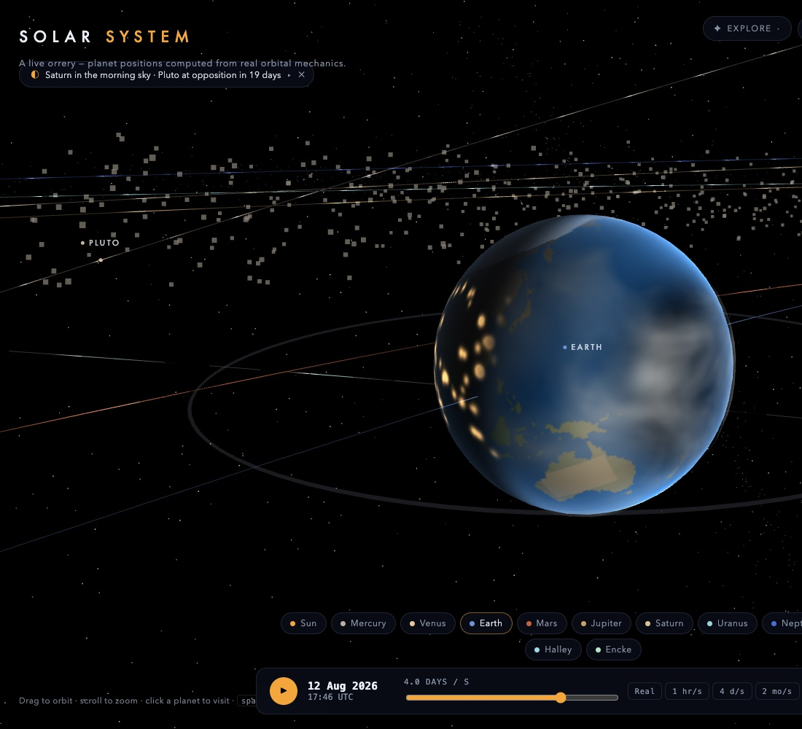
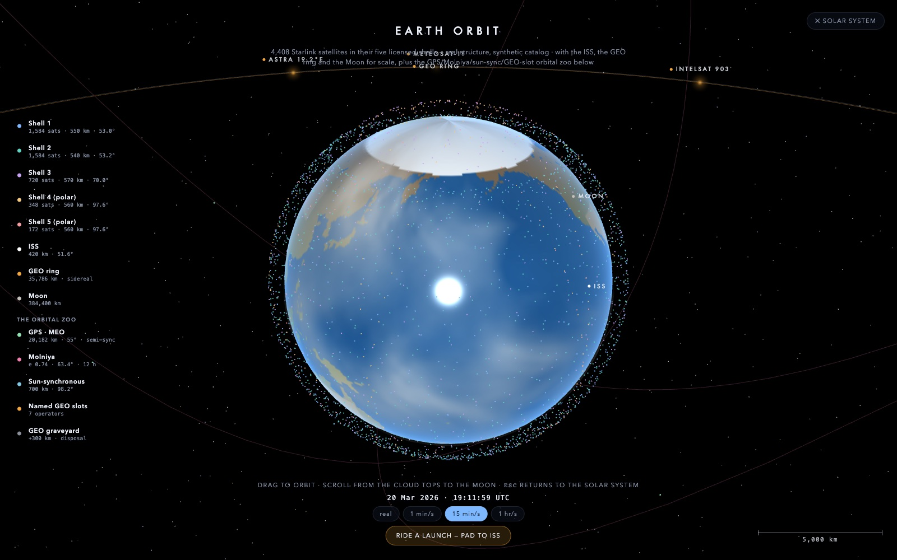
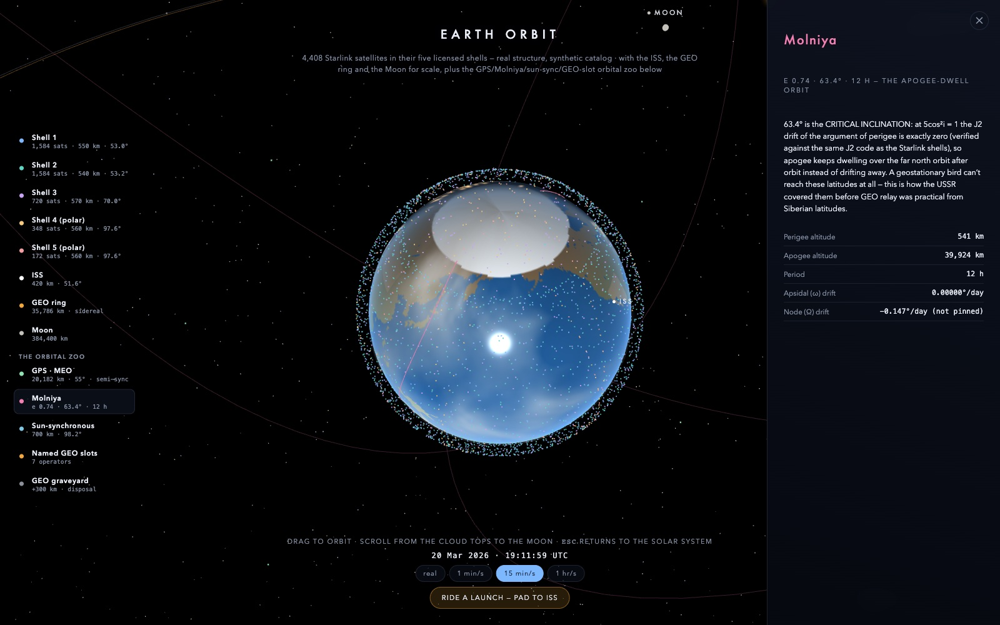
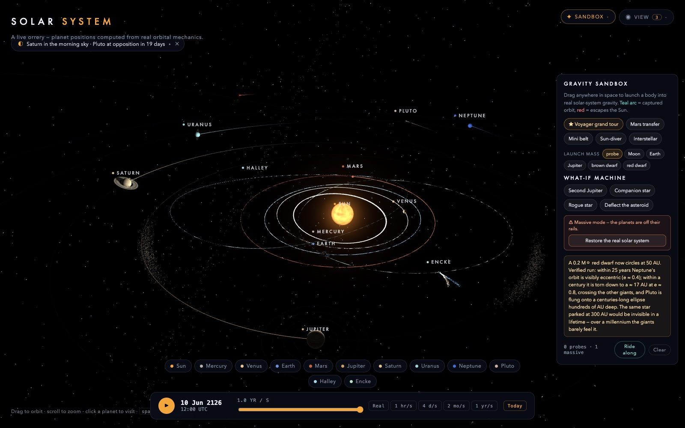
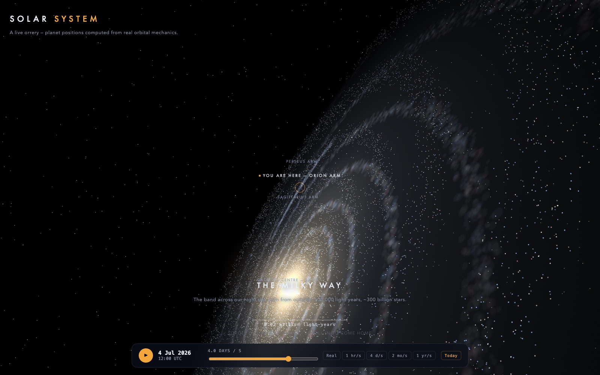

# Solar System — Live Orrery

[](https://github.com/JakobBullinger/solar-system/actions/workflows/ci.yml)
[](https://github.com/JakobBullinger/solar-system/actions/workflows/deploy.yml)

An interactive 3D solar system in the browser where nothing is animated by
hand: real Keplerian orbits from JPL elements, an honest n-body gravity
sandbox, and a Mission Designer game — with zero runtime dependencies,
bundled into one self-contained HTML file.

### **[▶ &nbsp;Open the live app](https://jakobbullinger.github.io/solar-system/)** &nbsp;·&nbsp; [Visitor's guide](https://jakobbullinger.github.io/solar-system/guide.html)


<p align="center"><sub>The orrery on load — every position computed live from JPL Keplerian elements; the time bar scrubs from real-time to a year per second.</sub></p>

<table>
  <tr>
    <td width="50%">
      
      <br><sub><b>Launch Window Lab</b> — a Mars porkchop plot computed live by a Lambert solver: gold valleys are cheap departures, repeating every ~26 months. Click one and the mission opens ready to aim.</sub>
    </td>
    <td width="50%">
      
      <br><sub><b>12 Aug 2026, 17:46 UTC</b> — the Moon's umbra on Earth at greatest eclipse, found by the app's own eclipse finder (full lunar theory + 3D shadow cones, no lookup tables).</sub>
    </td>
  </tr>
  <tr>
    <td width="50%">
      
      <br><sub><b>Earth orbit</b> — zoom into Earth and the map hands over to a kilometre-scale regime: 4,408 Starlink satellites in their five real shells, the ISS, the GEO ring, the Moon.</sub>
    </td>
    <td width="50%">
      
      <br><sub><b>The Orbital Zoo</b> — Molniya's critical-inclination orbit, its ground track painted onto the turning globe, and the dossier explaining why 63.4° is magic.</sub>
    </td>
  </tr>
  <tr>
    <td width="50%">
      
      <br><sub><b>The What-If machine</b> — park a red dwarf at 50 AU and the whole system promotes to true n-body physics: a century later Neptune is wrecked, and one click restores reality.</sub>
    </td>
    <td width="50%">
      
      <br><sub><b>The cosmic zoom</b> — keep scrolling out past Neptune: heliosphere, Oort cloud, the 20 nearest stars, and the night-sky band resolving into the Milky Way. You are here.</sub>
    </td>
  </tr>
</table>

## What's inside

| | |
|---|---|
| **Live orrery** | Sun, planets, moons and comets on real JPL Keplerian rails; day/night terminators, city lights, ring and moon shadows; scrub time from real-time to a year per second |
| **Sky almanac & eclipses** | Oppositions, elongations, conjunctions and every solar/lunar eclipse 2025–28 (instants within ~2 min of the canon), computed live — click any event to jump there; plus "the sky tonight" |
| **Gravity sandbox & What-If machine** | Drag-launch bodies up to star mass into real n-body gravity; verified scenarios: a second Jupiter, a companion star, a rogue star, an asteroid-deflection drill |
| **Mission Designer** | Nine missions against hard Δv budgets — flybys, a sun-grazer, orbit insertions, L2 station-keeping, the Voyager slingshot; star scoring, best-run ghosts, shareable challenge links |
| **Mission replays & the Mars manifest** | New Horizons and Cassini re-flown chapter by chapter in the app's own physics; the five real 2026–31 Mars missions with their transfer trajectories |
| **Earth orbit & Starlink** | A km-scale regime from the cloud tops to the Moon: Starlink shells, ISS, GPS, Molniya, named GEO slots, ground tracks, shadow crossings — and a pad-to-ISS launch ride |
| **Cosmic zoom** | Scroll out past the planets: heliosphere with the real Voyagers, Oort cloud, nearest stars, Milky Way, Local Group — a seamless powers-of-ten journey |
| **Physics overlays** | The gravity landscape with L-point saddles, speed-colored orbits (Kepler II visible), the Venus–Earth resonance rose, the Sun's barycentric wobble |
| **Grand tour** | A 12-stop guided cinematic through all of the above; the [visitor's guide](https://jakobbullinger.github.io/solar-system/guide.html) is the written map with deep links |

Everything above runs from a single static HTML file — no server, no network
requests, no accounts. The [guide](https://jakobbullinger.github.io/solar-system/guide.html)
has a 10-minute path and deep links straight into the good parts;
[Using the app](#using-the-app) below is the full control reference.

## Quick start

**[Play online](https://jakobbullinger.github.io/solar-system/)** — auto-deployed
from `main`. Or run it locally:

```sh
git clone https://github.com/JakobBullinger/solar-system.git
cd solar-system
node build.js        # → dist/index.html (no dependencies to install)
open dist/index.html # any browser; works fully offline
```

`dist/index.html` is fully self-contained — it can be double-clicked, mailed,
or hosted anywhere as a static file.

For development:

| Command | What it does |
|---|---|
| `npm run dev` | dev server with rebuild-on-save at http://localhost:4173 |
| `npm test` | zero-dependency unit suite (physics vs published ephemerides, ~1.5 s) |
| `npm install && npm run e2e` | 63-spec Playwright e2e suite against system Chrome |

The app itself has **zero runtime dependencies** (three.js is vendored, textures
are procedural, there are no network requests); Playwright is the repo's one
dev-only dependency, used for the e2e suite. A private Claude-artifact mirror of
the build lives at https://claude.ai/code/artifact/6cebdb03-7a56-40d8-b300-d5e4ed6170ac
(redeploy target after changes).

## How it's built

Plain ES5-style IIFE modules on a `window.ORRERY` namespace — no framework —
concatenated in dependency order by `build.js` into the single-file bundle.
Positions come from real ephemerides (JPL Keplerian elements, a full Meeus
lunar theory for eclipse-grade Moon positions), and the set-piece trajectories
(Voyager, New Horizons, Cassini, the Mars manifest) are baked offline by
Newton-shooting against the app's own integrator, then pinned by regression
tests. Details: [Architecture](#architecture) and
[Physics notes](#physics-notes) below.

Verification is the house culture: the unit suite plus the 63-spec Playwright
e2e suite (console-error trap, pixel-asserted screenshots against real
rendered frames) gate every PR in CI, every PR gets a live preview deployment,
and no mission par ships without a brute-force playtest scan proving it
beatable. The repo is developed by parallel Claude Code agent lanes — one git
worktree and branch per feature, an orchestrator session merging PRs,
re-verifying on `main` and deploying — with roles, protocol and hard-won
process lessons documented in [ORCHESTRATION.md](ORCHESTRATION.md).

## Using the app

*The [visitor's guide](https://jakobbullinger.github.io/solar-system/guide.html)
is the curated introduction; this is the complete reference.*

- **Everything lives in two controls, top right**: **✦ Explore** (Tour, Replays,
  Missions, Sandbox, Mars, Windows, Events) and **◉ View** (display toggles +
  physics overlays) — the control itself shows what's running while its menu is closed
- **Share any moment**: the address bar always encodes the current view —
  `?jd=…&body=…&play=0` plus sandbox bodies in the `#sb=` hash. Copy the URL
  at a paused conjunction or with your creations flying and the link reproduces it
- **✦ Grand tour** (top right): a ~3-minute guided cinematic tour of what the
  app can do — Sun, real-geography Earth, Halley in 1986 with the Kepler-II flow
  pulses, the almanac's next sky event, the 12 Aug 2026 total eclipse sweep, a
  what-if scenario (planets honestly off their rails, then restored), a baked
  MMX Mars-transfer preview, the Voyager grand tour, Earth orbit with the ISS
  ground track, and the powers-of-ten zoom-out finale. Auto-advances; arrow
  keys / dots navigate, Esc exits anywhere and unwinds every borrowed mode,
  camera and clock
- **Replays** (top right): fly real missions start to finish in the app's own
  physics, from the spacecraft's shoulder. **New Horizons** (2006–2015: fastest
  launch ever → Jupiter slingshot → Pluto) and **Cassini–Huygens** (1997–2004:
  Venus → Venus → Earth → Jupiter → captured at Saturn). Chaptered captions keyed
  to the sim clock, a live range/speed readout, dots/arrows to jump chapters
  (each jump re-flies the trajectory deterministically), Esc exits and restores
  your clock
- **Drag** to orbit, **scroll** to zoom, **click** a body (or its chip/label) to visit it
- **Keep scrolling out** past the planets and the view hands over to a
  log-scale cosmic zoom: the heliosphere with **Voyager 1 & 2** at their real
  positions (dossiers read live distance/light-time off the app clock), the
  Oort cloud, the **20 nearest star systems** (real directions, distances and
  spectral colors — click one: "light arriving now left in 2017"), the
  **Milky Way** (the background band resolves into the actual galaxy — you
  are here, Orion Arm), and the **Local Group** out to Andromeda. Stage
  captions and a live scale ruler (AU → light-years → millions of
  light-years) track the journey; scroll back in and you land exactly where
  you left the orrery
- **Space** pauses time; the time bar scrubs from real-time to 1 yr/s, presets + "Today"
- **Panel** shows a dossier per body: facts, stats, live distance/velocity from the physics
- **Planets with moons** list them in the panel — click to visit (e.g. Jupiter → Europa)
- **Comets** (Halley, Encke) grow comas and twin tails as they near the Sun;
  their panel has "jump to next perihelion"
- **Events** (top right): sky almanac of oppositions, elongations and conjunctions
  for the next 4 years, computed live — click one to time-jump there. Topped by
  **"The sky tonight"**: where the naked-eye planets are in the real sky right now
  (evening/morning/all night/hidden), with a teaser pill on load showing the
  headline planet and the next event countdown
- **Sandbox** (top right): drag anywhere in space to launch a body into real
  Sun + 8-planet gravity. Teal preview arc = captured orbit, red = escapes.
  Presets: **★ Voyager grand tour**, Mars transfer, mini belt, sun-diver, interstellar
- **Ride along**: chase-cam any sandbox body ("Ride along" in the sandbox HUD —
  launch the Voyager preset and ride the flybys) or a comet (button in its
  dossier). Scroll adjusts distance, Esc exits
- **Missions** (top right): the sandbox with goals. Nine missions launch from
  Earth against a hard Δv budget — drag sets your departure burn (direction +
  size, added to Earth's own velocity), a live preview with *moving* planets
  shows your closest approach, and the gold arc means you've got it. Release
  to review the flight plan: click the arc and drag to add a **mid-course
  burn** at that moment of the flight (same budget), then Launch. Stars for
  Δv efficiency; Grand Tour '77 sets the clock to the real Voyager window;
  **Halo Keeper** asks you to park at Sun–Earth L2 and hold station on the saddle;
  **Mars Orbiter** and **Ringside** end in orbit, not flybys — a plane-matched
  insertion burn at the target must leave you gravitationally bound, and the
  HUD reads out your capture orbit's periapsis × apoapsis live
- **Windows** (top right): the Launch Window Lab — a porkchop plot per target
  planet: departure Δv (color) over 6 years of departure dates × flight time,
  computed live from the app's own physics via a Lambert solver. Gold valleys
  are cheap windows (Mars repeats every ~26 months; scrub to 1977 and pick
  Jupiter to see the window Voyager rode). Hover reads a cell out; click one
  to set the clock to that departure — Venus/Mars/Jupiter open their mission
  ready to aim, window pre-found
- **Mars** (top right): the real Mars manifest — a timeline of the five
  missions actually flying to Mars next (ESCAPADE en route via its Sun–Earth
  L2 loiter, MMX, Rosalind Franklin, Tianwen-3, and the aspirational SR-1
  Freedom, drawn dashed), fact-checked July 2026. Each dossier carries the
  vehicle, profile and arrival strategy, and selecting a mission draws its
  reference trajectory in the scene — re-flown live in the app's own n-body
  physics, with the dossier reporting how close the arc passes to Mars.
  **Fly the transfer** jumps the clock to departure and launches the probe
  for real; the Launch Window Lab cross-links both ways
- **L-points** (top right): markers for the Sun–Earth and Sun–Jupiter Lagrange
  points L1–L5, each selectable with a dossier of its physics and residents
  (JWST at Earth L2, the Trojan camps at Jupiter L4/L5 — their asteroid swarms
  ride Jupiter's orbit whether the markers are on or not)
- **True size** rescales planets to honest ratios vs the Sun

## Architecture

Plain ES5-style IIFE modules on a `window.ORRERY` namespace, concatenated in
dependency order by `build.js` (data → physics → scene → ui → main):

```
index.template.html      markup shell; {{CSS}} {{VENDOR}} {{APP}} placeholders
styles/app.css           all styling
vendor/                  three.js + OrbitControls
src/
  data/bodies.js         Sun/planet/moon/comet data; JPL Keplerian elements (valid 1800–2050)
  data/stars.js          beyond the planets: Voyager state vectors, 20 nearest stars, Local Group
  physics/kepler.js      Kepler solver, heliocentric positions, scene-space compression
  physics/almanac.js     sky-event finder (oppositions, elongations, conjunctions)
  physics/nbody.js       restricted n-body integrator for the sandbox (AU/day units)
  scene/textures.js      procedural canvas textures (planets, night lights, clouds, rings, glows)
  scene/shaders.js       custom materials: terminator, atmosphere rims, analytic shadows
  scene/environment.js   starfield, Milky Way band (real galactic plane), asteroid + Kuiper belts
  scene/cosmos.js        Powers of Ten: log-scale cosmic zoom, stage cross-fades, dossiers
  scene/bodies3d.js      Sun/planet/ring/moon meshes and orbit lines
  scene/comets3d.js      comet nucleus, coma, ion + dust particle tails
  ui/timebar.js          simulation clock: Julian date advanced by a signed rate
  ui/labels.js           screen-projected HTML labels
  ui/panel.js            body dossier panel
  ui/almanac-ui.js       events drawer
  ui/sandbox.js          drag-to-launch, trails, presets, HUD
  ui/tour.js             guided cinematic tour: stops script, captions, choreography
  ui/ride.js             ride-along chase camera (probes, comets)
  ui/missions.js         Mission Designer: goals, aiming, budgets, scoring
  ui/permalink.js        deep links: URL ↔ app state (clock, selection, sandbox)
  main.js                bootstrap: scene graph, render loop, camera, picking
build.js                 bundler → dist/index.html
serve.js                 dev server with watch + rebuild
```

### Physics notes

- **Positions**: Keplerian elements at epoch J2000 with per-century rates
  (JPL "Approximate Positions of the Planets"), Newton-iterated Kepler solver.
  For comet eccentricities (Halley e=0.967) the iteration starts at E₀=π,
  which is globally convergent.
- **Scene compression**: true AU distances are compressed with a power law
  (`sceneR = 62·AU^0.52`) so the outer system stays on screen while ordering
  and eccentricity remain honest. Same mapping everywhere (planets, belts,
  comet tails, sandbox trails).
- **Sandbox integrator** (`nbody.js`): kick-drift-kick leapfrog in heliocentric
  AU/days; test particles feel Sun + 8 planets (JPL mass ratios) incl. the
  indirect frame term. Substeps ≤ 0.25 d, refined near the Sun by local
  dynamical time; swept-segment collision test so sun-divers can't step across
  the Sun. Time-symmetric — scrubbing backwards works.
- **Almanac**: daily-grid scan + bisection/ternary refinement. Verified against
  published dates (Saturn opposition 2026-10-04, Mars opposition 2027-02-19 exact).
- **Shading** (`shaders.js`): the Sun sits at the world origin, so the sun
  direction at any fragment is `-normalize(worldPos)` — no light uniforms.
  Planet shader: day/night terminator, Earth night-lights map (same noise seed
  as the day texture's landmask), per-planet atmosphere fresnel rim, and
  analytic object-space shadows: the ring annulus band on Saturn, the planet's
  shadow across its rings, and up to four moon shadows on a disk (so Galilean
  eclipses just happen). Per-frame uniforms via updaters driven from the loop.
- **Voyager preset** (`sandbox.js` `VOYAGER` const): launch window found by an
  offline search against this exact integrator (coarse scan → Jupiter-targeting
  → aim-plane scan → coordinate descent). Departs Earth 6 Aug 1977 at 38.5 km/s
  (θ=10.9215° in-plane, φ=−3.2301° out-of-plane) → Jupiter flyby 0.0094 AU on
  1979-12-12 → Saturn 0.0006 AU on 1982-10-25. Stable for frame chunks 0.5–5 d.

### Verifying changes

- Physics: small node scripts that `eval` the modules with a THREE stub
  (see conventions in git-less scratchpad workflow below).
- Visual: headless Chrome needs SwiftShader —
  ```
  "/Applications/Google Chrome.app/Contents/MacOS/Google Chrome" --headless \
    --use-angle=swiftshader --enable-unsafe-swiftshader \
    --window-size=1600,1000 --virtual-time-budget=15000 \
    --screenshot=out.png "file://$PWD/dist/index.html"
  ```
  (plain `--disable-gpu` renders a black canvas). Long time-lapses can't rely on
  virtual time; drive `ORRERY.Sandbox.tick(jd, jd+2)` in a loop from an injected
  script instead.

## Development log

The running log of every landed change, oldest first — this table is the
project's history and is appended to after every merge.

| Date | Level | What landed |
|---|---|---|
| 2026-07-02 | 1 · Scene | Sun, 8 planets + Pluto, procedural textures, starfield/Milky Way, asteroid + Kuiper belts, orbit camera |
| 2026-07-02 | 2 · Living physics | JPL Kepler engine, time bar (real-time → 1 yr/s), dossier panel with live telemetry, true-size mode, orbit lines, picking |
| 2026-07-02 | 3 · Wanderers | Comets Halley + Encke: distance-driven coma and ion/dust tails, dashed orbits, "jump to next perihelion" |
| 2026-07-06 | 4 · Events & moons | Moons selectable with own dossiers (Moon, Galileans, Titan), sky almanac drawer (oppositions/elongations/conjunctions, verified vs published dates), time-jump with auto-pause |
| 2026-07-06 | 5 · Sandbox | Restricted n-body gravity layer, drag-to-launch with bound/escape preview, presets (Mars transfer, mini belt, sun-diver, interstellar), fading trails, swallowed/escaped bookkeeping |
| 2026-07-06 | 6 · Grand tour | Voyager preset: offline launch-window search reproduced a 1977 Earth → Jupiter → Saturn slingshot chain in-app |
| 2026-07-06 | Tooling | Dev server (`serve.js`, `npm run dev`), this README as running log/reference, app published to a hosted URL |
| 2026-07-06 | 7 · Cinematic tour | Guided 8-stop tour: camera choreography via `focus`/`flyHome`, per-stop time rates, Halley-1986 + Voyager-1977 time-travel stops, caption card with auto-advance, UI auto-hide, clock restored on exit |
| 2026-07-06 | 8 · Worlds up close | Git repo initialized. Custom shaders: day/night terminators, Earth city lights + drifting clouds, atmosphere rims per planet, Saturn ring↔planet mutual shadows, moon transit shadows, limb-darkened animated Sun |
| 2026-07-06 | 9 · Sharing & mobile | Deep links (URL ↔ full app state incl. sandbox bodies), viewport + PWA meta with data-URI manifest/icon, touch-action + small-screen layout pass, first-visit tour offer |
| 2026-07-06 | 10 · Ride-along | Chase camera for sandbox probes and comets: ride the Voyager flybys from the probe's shoulder; scroll-zoom, Esc exit, auto-exit on body death, planet-interior avoidance |
| 2026-07-06 | 11 · Tonight's sky | Elongation-based visibility for naked-eye planets (real clock, not sim clock), "sky tonight" section in the almanac, load-time teaser pill with next-event countdown, "in Nd" chips on event rows |
| 2026-07-06 | 12 · Mission Designer | Six missions with Δv budgets, drag-set departure burns, time-accurate aiming preview (moving planets + live closest-approach), star scoring vs par, localStorage bests. All verified winnable by brute-force playtest; Grand Tour '77 anchored to the real Voyager window and verified to require the slingshot |
| 2026-07-06 | Tooling | CLAUDE.md (architecture + hard-won physics/verification notes) and four Claude Code project skills in `.claude/skills/`: headless-check, playtest-scan, deploy, explain-diff. Levels 13 (challenge links) + 14 (mid-course burns) in development on parallel worktree branches |
| 2026-07-06 | 13 · Challenge links | Mission runs are shareable: `?ch=mission,jd,vx,vy,vz,stars` (burn vector as integer micro-AU/day, ~0.002 km/s precision) replays the exact flight as a ghost run under a "Beat this: ★★★ by a friend" banner — no stars banked, budget-validated against forged links — then hands over for a counter-attempt with a beat/matched/still-theirs verdict. Every win grows a "Copy challenge link" action (`challenge.js`); permalink freezes the URL while the ghost flies; classic `?jd/body` + `#sb=` links untouched. Round-trip verified headless: a 3★ Mars link found by offline search replays to the same 3★ and regenerates a byte-identical link |
| 2026-07-06 | Tooling | ORCHESTRATION.md: multi-agent worktree setup (roles, filesystem protocol, merge order, two-layer verification bar) + planned v2 PR-based flow with CI. Level 13 merged to main, verified, deployed |
| 2026-07-06 | 14 · Mid-course burns | Releasing the departure drag now opens a flight plan: click a point on the previewed arc (each point carries its time-of-flight) and drag a second Δv from it — both burns share the mission budget, and the flight integrator splits its step to fire the impulse at its exact jd (`previewLive` gained scheduled burns + timestamped points). Gold-arc verdicts are now time-gated to the mission limit. Icarus par retuned 18.8 → 15: a two-burn scan (raise aphelion, then kill your speed out there) found a flight-confirmed 14.5 km/s minimum vs ~18.2 single-burn, and the hint teaches the trick. All six missions re-verified 3★-able at par by scans + flight-grade sims; a Grand Tour two-burn scan found nothing below its single-burn minimum, so its par stands. Challenge links replay the departure burn only for now |
| 2026-07-06 | 15 · Mission replays | Narrated, chaptered replays of real missions riding the spacecraft (`replays.js`, reusing the tour card + ride cam): **New Horizons** is fully ballistic — one offline-searched launch state (42.813 km/s, found by stepping the app's own integrator exactly as live playback slices frames) hits Jupiter at 0.0153 AU on 28 Feb 2007, the historical date, then Pluto at ~0.0003 AU on 14 Jul 2015. **Cassini** flies the whole VVEJGA chain (Venus 0.0025 → Venus 0.0025 → Earth 0.0025 → Jupiter 0.020 AU → Saturn, captured); the softened integrator can't bend inner-planet flybys hard enough, so each big assist is applied as a searched reference velocity at closest approach, and SOI is computed live at the detected Saturn closest approach — the chain survives ±35% frame-time jitter. Burns split the integration at their exact jd; chapter jumps re-fly the trajectory deterministically; clock saved/restored on exit. Verified headless through `Sandbox.tick` (the live code path) + UI state assertions + a rendered mid-replay screenshot |
| 2026-07-06 | 16 · Share everything | Challenge links now carry the whole flight plan: `?ch=` gains an optional 4-field suffix (`t` days after departure + the mid-burn vector in the same integer micro-AU/day encoding), validated on replay against the mission's own budget and deadline — legacy 6-field links decode unchanged and single-burn runs still emit them. And every mission now banks your best winning run (burns + launch jd in `orrery-mission-best`, kept when it out-stars or out-thrifts the record): the brief screen grows a "Watch best run · ★★★ 14.8 km/s" action that ghost-replays your own record with a "top yourself" verdict. Verified headless: an offline-searched two-burn 3★ Icarus link (8 + 6.75 km/s, retro at aphelion T+720 d, perihelion 0.068 AU) replays to the same 3★ with the impulse firing in-flight and regenerates a byte-identical link; a legacy Mars link round-trips likewise; over-budget and malformed mid-burn links refuse to fly; best-run record → guard → brief button → replay → banner exercised in the real app |
| 2026-07-06 | 17 · Launch Window Lab | In-app porkchop plots: a universal-variable Lambert solver (`lambert.js`, bisection on z with y<0 treated as z-too-low so >180° transfers never break the bracket) feeds a Δv heatmap per target — 180 departures × 80 flight times over 6 years, computed in async chunks (UI never blocks), painted progressively, cached per target until the clock drifts. Δv is the game's own currency (heliocentric impulse off Earth's rail), so valleys agree with mission pars. Hover reads out a cell; click sets the clock to that departure, and Venus/Mars/Jupiter open their mission aiming at the pre-found window (`Missions.aimAt`, the module's one new entry point). Verified offline (Mars minima 2.8–3.0 km/s spaced 780–820 d; 1977 Jupiter window 10 d from Voyager 1's launch; Lambert arcs re-integrated in `previewLive` hit within mission tolerances) and headless via CDP (grids, valley-vs-plateau contrast 9.4 vs 33.8 km/s for Sep 1977, click-to-aim flow, zero console errors) |
| 2026-07-07 | 18 · Orbit insertion | Missions can end in orbit: new **orbiter** class — win = a bound orbit (negative two-body energy inside the target's Hill sphere, `relPlanet()`) held N consecutive days with periapsis *and* apoapsis ceilings; `previewLive` tracks the capture streak and the flight HUD reads out osculating peri × apo live. Physics honesty first: measured the integrator already holds Mars (0.001–0.005 AU) and Saturn (0.005–0.08 AU) capture orbits at flight *and* preview step sizes — zero dynamics changes, trajectory guard untouched. The playtest scan then proved in-plane burns can **never** capture (Mars crosses its node at 0.78 km/s out-of-plane, more than escape speed anywhere in its Hill sphere), so orbiter insertion burns plane-match — the z-component that cancels relative vz is added automatically and charged to the budget at true cost. New missions: **Mars Orbiter** (peri < 0.005 AU, hold 60 d, par 5.8 from a scan-champion 5.69: 3.05 dep 2026-11-06 + 2.64 insertion at T+285 d) and **Ringside** (Saturn capture, epoch-anchored mid-2028 so a ~6-year cruise arrives on Saturn's June-2034 ecliptic crossing — the only one until 2049; par 14.0 from 13.80). Both champions jitter-robust 36/36 across playback rates 10–40 and baked into `insertion.test.js`; the apoapsis ceiling also killed loosely-bound Hill-riding cheese and lifted preview↔flight verdict agreement from 76% to 100%. E2E headless via CDP: champion replay wins in-app, HUD showing `in orbit: peri 0.0005 × apo 0.0040 AU · 60/60 d` |
| 2026-07-07 | 22 · Powers of Ten | Scrolling out past max zoom now keeps going: a log-scale cosmic zoom (`cosmos.js` + `stars.js`) rescales one world-group by `viewR/10^L` each frame (L = log₁₀ of the half-view in AU, 2 → 11.8), so there are no far-plane or float-precision cliffs anywhere from 100 AU to 10 million light-years. Five cross-faded stages, all real data: **heliosphere** (Parker-teardrop heliopause, Sedna's orbit, Voyager 1/2 at true RA/Dec with linear drift — dossiers read live range/light-time off the app clock: 170.9 AU / 23.7 h in Jul 2026, matching NASA's trend); **Oort cloud** (Hills torus + outer shell; the ruler teaches 1 ly = 63,241 AU); the **20 nearest star systems** (J2000 → ecliptic conversion, spectral colors, dossiers with "light arriving now left in 2017"); the **Milky Way** — the starfield's band re-oriented to the *real* galactic plane (statistically identical look) so it can resolve into a painted-plus-particle galaxy with Sgr A* in the true direction and a pulsing "you are here" on the Orion Arm; the **Local Group** (13 galaxies at real distances/directions, Andromeda and Triangulum as tilted discs). Orrery chrome hides in deep space; scroll-in restores everything exactly — including a hard-won fix: opacity-0 orbit lines still write depth and punch black arcs into the additive galaxy, so faded roots must be hidden outright. Guards keep tour/ride/sandbox/missions exclusive of the zoom. Verified headless: screenshots at all five stages, Voyager + Sirius dossier cards with live rows, and a wheel-driven round trip (real WheelEvents: dolly to max → handoff → deep zoom → scroll home) landing back in the normal orrery with controls alive; `cosmos.test.js` pins the data layer to catalog values (NGP geometry, Sirius ecliptic coords, Voyager ranges, Local Group distances) |
| 2026-07-06 | 19 · Three-Body Room | Lagrange points as first-class citizens: `lagrange.js` solves the CR3BP collinear balance by bisection (roots cached per mass ratio; node-checked: Sun–Earth L1/L2 at 0.0102 AU, Sun–Jupiter L1 at 0.35 AU) and L4/L5 ride ±60°; an **L-points** toggle shows ten selectable markers with dossiers (JWST/Euclid at Earth L2, SOHO's storm-warning perch at L1, the sci-fi Counter-Earth at L3, Lucy touring the Trojans); always-on Trojan swarm clouds track Jupiter's actual L4/L5 bearings. New mission **Halo Keeper**: park within 0.01 AU of Sun–Earth L2 and hold 60 days — departure-only tops out at ~51 d (the saddle is real), so the mid-course burn is the mission. Playtest scan: 6,233 winning plans, 304/400 robust to frame-step jitter, min 0.4 km/s → par 0.5; station-keeping preview runs flight-grade steps (h=0.25), 99% verdict agreement; beaten 3★ in-app headless |
| 2026-07-07 | 23 · Mars planner | The real Mars manifest, visualized: a **Mars** drawer with a timeline of the five verified next missions (deep-research fact-check 2026-07-06; NASA/ESA MSR and Starship deliberately excluded) — ESCAPADE (loitering at Sun–Earth L2 now, powered Earth-flyby departure Nov 2026, Mars Sept 2027), MMX, Rosalind Franklin, Tianwen-3, SR-1 Freedom (aspirational → dashed). Each mission carries a dossier and a baked reference trajectory: Lambert transfers seeded from the NASA design-handbook windows, Newton-shooting refined offline so `previewLive` from the baked departure state threads Mars within 670–1,700 km on the reference arrival date; Rosalind Franklin's 26-month cruise needed an offline **one-revolution** Lambert scan (zero-rev bottoms out at C3 ~40; the 1-rev family gives C3 21.6, dep 10 Oct 2028 → Oxia Planum 3 Dec 2030). ESCAPADE's L2-loiter year draws from `Lagrange.point` samples and its L2 dossier cross-links back; "Fly the transfer" hands the state to the sandbox integrator and runs the clock to arrival. `mars-planner.test.js` doubles as level-17 validation: our `lambert.js` reproduces all 7 published handbook C3/v∞ fixtures to ±0.05/±0.02 and grid minima land on the handbook's dates. E2E headless: drawer + dossiers render, ESCAPADE/MMX arcs pass 790/697 km from Mars on 8 Sep / 9 Aug 2027, flown MMX arrives on date, zero console errors |
| 2026-07-07 | 26 · Seeing the Invisible | Four physics overlays behind one **Physics** drawer (`vizpanel.js` owns all wiring; main.js gains only init+tick), each a toggle that draws something real. **Gravity landscape** (`gravitywell.js`): a polar wireframe under the ecliptic bends by log-scaled solar potential — funnel readable Mercury→Neptune instead of one spike — with per-planet dimples depth-ordered by mass (widths floored so Earth's well survives the distance compression: ordering honest, absolute depth not); switch frame to Earth/Jupiter co-rotating and a magnified patch pinned under the planet draws the CR3BP effective potential with its **L1/L2 saddle passes**, positions taken from `lagrange.js` (read-only) so surface and markers can't disagree — the patch is static in the rotating frame and only re-rotates each frame (radial compression commutes with rotations about the pole). **Speed colours** (`overlays.js`): vis-viva vertex colours baked once onto every orbit line by inverting the scene compression per vertex and recovering a = (r_min+r_max)/2 from the loop itself — one global 3–60 km/s log ramp, so Mercury burns, Neptune crawls, comets flash red at perihelion; a live velocity arrow + km/s tag rides the selected body, and sandbox/mission preview arcs tint by speed (from consecutive sample spacing — two guarded one-liners in sandbox/missions) so a slingshot visibly steals speed and keeps it. **Resonance rose** (`spirograph.js`): the Venus–Earth chord every 4 days sweeps the five-petalled 8-year rose; Earth–Mars, Jupiter–Saturn 5:2 and the Galilean 1:2:4 pulse (chords in Jupiter's tilt frame) selectable; sim-time sampling with analytic Kepler backfill makes the figure identical at any playback speed or headless clock jump. **The Sun's wobble** (`barycenter.js`): the barycentre rosette as a ×6,500 inset with the Sun's photosphere circle at the same scale — the pivot exits the disc when Jupiter and Saturn gang up — ~130 y fading trail (two J–S beats), masses = the integrator's own JPL ratios, plus a Sun-dossier stat: this wobble is how exoplanets are found. All overlays LineSegments/vertex-colour/additive with depthWrite off (SwiftShader-safe, no depth-punch), suppressed while the cosmic zoom owns the screen. Verified: `seeing-invisible.spec.js` — every overlay toggled on/off with zero console errors, 9 pixel-asserted screenshots (rose, Galilean pulse, wobble, all three landscape frames incl. Earth's L1/L2 saddles), Earth's arrow reads 28–32 km/s, accumulation driven through `driveTicks` clock jumps (750+ chords across two 1,500-day leaps) |
| 2026-07-07 | Tooling | e2e harness: Playwright on system Chrome (`npm run e2e`), console-error trap + `driveTicks` virtual-time workaround as a spec library; `lane-check` pre-PR audit script; rebake + lane-check + e2e-harness skills. Dev flow is now PR-based (ORCHESTRATION v2): agents open PRs, CI gates them — this row landed via PR #1 |
| 2026-07-07 | Tooling | CameraPath: the repo's four camera-easing implementations unified into one shared primitive (`camerapath.js` — keyframed position/target flights, pluggable easing with the classic cubic ease-out default, begin/cancel/isActive/tick, one-flight-at-a-time ownership). main.js focus/flyHome, tour stop transitions and the cosmic-zoom exit restore now ride it; Ride's per-frame chase stays its own (it follows a moving target, not a path) and only its boundary cancellation goes through the primitive — including the subtle rule that a flight begun by an onStop handler mid-ride-exit is discarded, exactly as before. Behavior-preserving by construction: same 1.6 s duration, same ease, same interrupt points. Parity proven by `camerapath.spec.js`: chip-click flights land on the exact old destination (snap *and* animated paths), Esc mid-tour restores camera + clock, cosmos round trip lands at max-zoom·0.9, mission aiming holds with no stray flight — plus tour-stop-2 / mission-aim / post-cosmos-exit screenshots. Found en route: the e2e config's `use.reducedMotion` never reaches the page (specs now emulate it per-page) |
| 2026-07-07 | 25 · Living orbits | Physics-driven animation, six pieces riding data the physics already produced. **Trajectory draw-in** (`trajanim.js`): previewLive keeps a point every fixed number of integrator steps, so easing the geometry draw range plays any arc along its own time axis — wired into Mars-planner transfers and mission flight plans. **Probe glyph**: a sprite riding cached previewLive points indexed by the sim clock (AU-lerped between samples) — scrub the time bar and ESCAPADE walks its transfer at zero physics cost. **Orbit flow** (`orbitflow.js` + a **Flow** toggle): orbit lines gain an additive pulse-train overlay whose per-vertex attribute is the mean-anomaly fraction (Kepler's equation on the same E-sweep the line was drawn from) and whose phase is the body's own mean anomaly at the sim clock — pulses move at the TRUE local rate, stretching long and whipping through perihelion, crawling bunched at aphelion (Kepler 2 visible, comets dramatic; pause time and the streams stand still). Base lines untouched so the cosmic-zoom fade and the Orbits toggle work unchanged; the overlay is additive + depthWrite:false (level-22 lesson). **Trail age-fade + burn flares** (sandbox): trail vertices remember the sim time they were laid and fade by actual age, and scheduled impulses bloom a brief additive flare where they fire — mission mid-course burns auto-detected off `p.burns`, Cassini's DSM/flyby kicks and its Saturn orbit insertion via the new `Sandbox.flareAt` — burns are no longer HUD-only events. **Eased clock jumps**: every `TimeBar.jd` teleport (porkchop picks, almanac events, mission epochs, next-perihelion, Voyager's 50-year rewind) is now a ~0.55 s logarithmic ease; the sandbox accumulates the whole jump into the single step it used to be, so the 30-day teleport-guard semantics are exactly preserved (proved in-spec), `snapJd` covers replay choreography that re-integrates synchronously, and reduced motion snaps. **Director mode** (`director.js`): after 75 s without input the camera cuts between slow composed beauty shots built on CameraPath (cut = instant flight, drift = one 14 s eased arc, dwell, next subject) until any input exits; Ride/Tour/Sandbox/Missions/Cosmos/Replays and open drawers block entry and force exit. Verified: `npm test` green; 16 e2e specs green incl. new `living-orbits.spec.js` (draw-in completes and snaps under reduced motion, glyph tracks the clock and parks outside its window, Flow toggle round-trips, an organically-fired burn flares, an eased jump lands exactly with physics untouched, director enters/composes/exits and respects guards); screenshot artifacts of orbit flow (home + comet close-up), a burn-flash close-up and a director composed shot |
| 2026-07-07 | Fix · Mars drawer CSS | The real-manifest drawer rendered unstyled (year labels run together, no timeline bars, dossier stat labels fused to values): a hand-resolved merge had spliced the cosmic-zoom CSS block into the middle of the `#mp-close` rule, deleting six of its declarations and its closing brace — under CSS Nesting, every `.cz-*` and `.mp-*` rule until the stray compensating `}` ~300 lines later silently parsed as `#mp-close .…` and matched nothing (JS and all tests stayed green; only computed styles show it). Restored the rule tail and removed the stray brace, which also brings back the swallowed cosmic-zoom overlay styles. Regression-proofed in `marsplanner.spec.js`: computed-style assertions (`.mp-track` relative/7px, `.mp-seg`/`.mp-years` absolute — verified to fail on the broken sheet), five rows visible, ESCAPADE default-selected with 3 scene objects incl. the faint L2-loiter arc, and every mission's dossier opens with its re-integrated arc threading Mars < 0.005 AU |
| 2026-07-07 | UI · Header redesign | The ~13-chip top bar folded into two controls: **[✦ Explore ▾]** (Tour, Replays, Missions, Sandbox, Mars, Windows, Events as icon + name + one-line description rows) and **[◉ View ▾]** (display toggles, physics-overlay quick toggles that proxy the vizpanel's own buttons, and the overlay drawer). Key trick: every former chip keeps its element ID inside the menus, so all feature modules needed zero changes — new `ui/header.js` only owns open/close/keyboard/outside-click and *observes* aria-pressed to reflect state onto the closed controls (Explore renames itself after the active experience; View carries an on-count badge). Menus are in-flow accordion panels (two open menus stack, never overlap); the header slides clear while a right drawer (info panel / vizpanel) covers its corner; `body.touring`/`body.cosmos` hide it exactly like the old rail; mobile gets icon-only finger controls with full-width sheet menus; Explore auto-opens once on a first visit (localStorage-gated). Verified: all 21 pre-existing e2e specs pass unchanged (gotoOrrery pins menus open so legacy `#opt-*` clicks stay actionable — disclosed in `orrery.js`) + 8 new `header.spec.js` specs (open/close/Esc/outside-click, active-state reflection, proxy round-trip, drawer shift, chrome-hide parity, first-visit auto-open, mobile sheets) with desktop + 390px screenshots |
| 2026-07-07 | 20 · What-if machine | The sandbox stops lying about mass: launch anything from a probe to a **red dwarf** (new mass selector: probe/Moon/Earth/Jupiter/brown dwarf/red dwarf) and the first massive body **promotes** the whole system into a true n-body regime where Sun and planets leave their Kepler rails — inertial barycentric internal frame with heliocentric readout, one shared adaptive substep (H_CAP = 0.25 d set by 1000-year measurement: dE/E 1.6e-7, Mercury perihelion drift ±0.026%, |P| ~1e-22), momentum-conserving merges, a substep-budget throttle, and the rails regime bit-identical when no massive body exists (known artifact documented: numerical Mercury apsidal precession −0.14°/yr). UX keeps the physics honest: orbit ellipses fade out (they'd be lies), planets grow truth-trails, the belt hides, a ⚠ massive-mode banner offers "Restore the real solar system", and missions refuse to fly until you do. Four scan-verified **what-if scenarios** in the sandbox HUD: a second Jupiter at 2.55 AU (eats 3/12 belt bodies in 25 y, Mars 0.89 AU off-rail in 200 y), a red-dwarf companion at 50 AU (tears Neptune to a≈17 AU/e≈0.81 in a century; 300 AU control stays quiet for 1000 y), a rogue sun-mass star at q = 20 AU (ejects Neptune, Uranus e≈0.9), and a **DART drill** — an asteroid baked via Lambert + Newton shooting to a 14 km Earth impact, live miss-distance readout, deflection scaling with lead time (17k/30k/68k km at 80/150/220 d). Verified: `whatif.test.js` 7/7 (regime invariants, promoted-energy pin, DART lead-time scaling) + `whatif.spec.js` 6 e2e specs (drag-launch promotes/restores through the real UI, every scenario's thresholds, IMPACT→miss flip after an in-page impactor strike, missions guard) |
| 2026-07-07 | Tooling | CI runs the full Playwright e2e suite on every PR and push: a second `e2e` job in `.github/workflows/ci.yml`, separate from `build-test-smoke` so a red e2e never hides the fast smoke signal — `npm install` + build + `npm run e2e` against the runner's preinstalled system Chrome (Playwright's `channel:'chrome'` finds it at `/opt/google/chrome/chrome`; zero config change), single worker by design (~5 min), `tools/e2e/artifacts/` (spec screenshots + Playwright test-results) uploaded on failure as the debugging payload. Closes the hole where a post-rebase e2e failure (PR #8's) was invisible to CI. Verified: full suite green locally and in the PR's own CI run with the real spec count in the log, plus a deliberately-broken assertion pushed to prove the job goes RED, then reverted (run URLs in the PR) |
| 2026-07-07 | 24 · Earth orbit & Starlink | The zoom-IN mirror of the cosmic zoom: an **Earth-centered km/minutes regime** (`earthorbit.js`), entered from the Explore menu (**Earth orbit**) or by wheeling in past max zoom while visiting Earth. The heliocentric compression makes LEO→GEO sub-pixel, so the mode hides the orrery solids (starfield stays), parks an Earth at the origin at 1 unit = 1,000 km, and lets the camera fly from the cloud tops to the Moon — no world-scaling trick needed, the whole regime is two orders of magnitude. Lighting honesty: the planet shader assumes the Sun at the origin, so the mode carries its own Earth/cloud materials with an explicit sun-direction uniform from Earth's Kepler position — the terminator tracks the sim clock, and the mesh spins with main.js's own phase formula. Time gets its own feel: the mode saves the TimeBar's {rate, playing}, offers real/1 min/15 min/1 hr per-second rates, and restores the saved state exactly on exit (camera pose too, via an instant CameraPath flight). Content (`data/starlink.js`): the REAL Starlink Gen1 shell structure — 4,408 sats in the five FCC-licensed shells (550 km/53.0° 72×22, 540/53.2° 72×22, 570/70° 36×20, 560/97.6° 6×58 + 4×43) — with a SYNTHETIC Walker-delta catalog (no TLEs, zero network) propagated on circular orbits + first-order J2 nodal precession (Vallado: ISS −4.95°/day), rendered as per-shell point clouds with selectable dossiers (counts, altitude, period, speed, node drift). Scale anchors: the ISS (real 420 km/51.6°), a GEO ring whose 1436.07-min period *is* the app's own sidereal Earth spin — so its markers visibly hang still over the turning surface while the LEO swarm races — and the Moon at its true 384,400 km (schematic phase, labeled). Verified: `earthorbit.test.js` 8/8 vs handbook values (v/T at 420/540/550 km, GEO = sidereal day, J2 rates, 4,408-sat structure, catalog geometry) + `earthorbit.spec.js` e2e (enter through the real menu, shell dossier, **LEO sat sweeps degrees of Earth-fixed longitude in 20 min while GEO's is pinned to <0.01°**, wheel-in entry, Esc exit, camera/TimeBar/scene restored exactly, wide + day-side close-up screenshots, zero console errors). Rocket-ascent ride-alongs: deliberately not attempted this wave |
| 2026-07-07 | Tooling | CI run dedupe + fleet telemetry for subagent lanes. `ci.yml`'s `push` trigger restricted to `main`, so a PR branch push runs the matrix once (the `pull_request` run) instead of twice (~2× 3.5 min of e2e back). And `tools/fleet.js` now sees background-subagent lanes (the wave-5 mode): when a lane has no per-worktree transcript, it scans the orchestrator project dir's `<session>/subagents/agent-*.jsonl` files (all lines there are `isSidechain:true` — measured, the old first-user-message filter skipped them) and attributes the newest one whose launch prompt names the lane's worktree; such rows carry a ` [sub]` verdict suffix. Attribution + telemetry now testable: `FLEET_PROJECTS_ROOT` injects a fixture tree, `test/fleet.test.js` (8 tests) pins per-worktree vs subagent vs no-session attribution, newest-match-wins, message.id token dedupe and the `[sub]` label. Live proof: the lane that built this — itself a background subagent — showed `WORKING [sub]` with real turn/token telemetry in its own fleet table |
| 2026-07-07 | Tooling | PR preview deployments (hosting-arc step 3): every same-repo PR gets a live playable build at `…/solar-system/previews/pr-<n>/`, auto-commented on the PR (one sticky comment, edited in place per push) and deleted when the PR closes. Mechanism: Pages switched from artifact-mode (`actions/deploy-pages` replaces the whole site per deploy — previews can't coexist) to serving the **`gh-pages` branch**, seeded byte-identical to the live site so the flip is invisible; `deploy.yml` now pushes main's build to the branch root and then polls the live URL until it serves those exact bytes (green Deploy = site really updated, red = Pages source misconfigured), `pr-preview.yml` (plain `pull_request`, never `pull_request_target`; fork PRs skipped) writes `previews/pr-<n>/index.html` — disjoint paths + per-PR concurrency groups + a rebase-retry push loop serialize the shared-branch writes. Verified on its own PR (#12): preview workflow green in 24 s, gh-pages carrying `previews/pr-12/index.html` byte-identical to the local merge-commit build, sticky comment posted then edited (not duplicated) on a second push; cleanup proven with a throwaway scratch PR (opened → previewed → closed → directory gone, comment struck through). The Pages source flip itself is the orchestrator's one-command cutover at merge |
| 2026-07-07 | 27 · Eclipse finder | The almanac learns eclipses, and the Moon gets real: `physics/moon.js` is the full Meeus ch. 47 lunar theory (60 longitude/distance + 60 latitude terms + A1/A2/A3 additives; worked example 47.a reproduced exactly; ~10″ accuracy — eclipse-grade) — the deliberate "schematic Moon" debt paid exactly where it matters. `physics/eclipse.js` finds eclipses with **no Besselian elements and no lookup tables**: syzygy scan (daily grid + bisection on Moon−Sun elongation) then true 3D shadow-cone geometry in km — including the subtlety that bodies.js's "earth" elements are the Earth–Moon **barycenter** (up to 0.7 R⊕ of pure eclipse error), so Earth's true position is recovered as EMB − r_moon/82.3 first. Verified against the published canon before any UI: **18/18 eclipses 2025–2028 found both ways (no misses, no false positives), all types exact (incl. 2026-02-17 annular vs 2026-08-12 total discrimination), instants within ~2 min, γ within 0.002** (`eclipse.test.js`, 27 tests); borderline central types would be labelled "hybrid" and partials hedge with a magnitude — never overclaim. The almanac drawer opens with an **Eclipses** section (solar amber / lunar copper row accents, honesty note on the schematic umbra size); a jump is a *sweep*, not a freeze: the clock lands ~86 min before greatest eclipse playing at ~11.5 sim-min/s, so a ~3 h event plays out in ~15 s. The spectacle rides one new scene module (`moonsync.js`): it re-sources ONLY Earth's Moon from the real theory — direction real, display radius schematic (the true 60 R⊕ would sit past Venus in compressed scene space) — by reparenting the mesh out of the schematic equatorial pivot and placing it each frame just before the existing ≤4-moon shadow pass reads it, so **the umbra lands on Earth at the finder's instants with zero shader changes**, and full moons tint copper by umbral immersion (whole-disk; per-pixel gradient deferred). Found en route: the anti-solar shadow axis is a RAY, not a line — without the `t ≤ 0` guard the copper tint fired at new moon (caught by the first e2e screenshot, pinned by a regression test). Verified: `npm test` green (trajectory guard untouched); `eclipse.spec.js` e2e — almanac lists 2026-08-12 17:4x UTC near 65°N 26°W, click sweeps (playing, readable rate, lands in window), Sun–Moon–Earth alignment cos > 0.9994 at pinned max, a **pixel-level A/B umbra proof** (identical framing at max vs +3 d: disc luma 87 vs 158 — a silently no-op'ing shader can't pass), copper Moon at 2026-03-03 mid-totality (umbra = 1, copper ratio > 2) reverting to the exact base color a day later; screenshots of both spectacles |
| 2026-07-07 | Fix · What-if HUD clip | User-reported (live site): clicking any What-If scenario cut the sandbox panel off at the top of the screen. Root cause: the HUD is bottom-anchored (`bottom: 148px`) with unbounded height, and a scenario adds the massive-mode banner + a long verified caption (~+300 px, 645–679 px total) — the growth goes UPWARD, so on laptop-height viewports the panel top left the screen (measured −73…−177 px at 720/650 px tall) and buried the header. Fix: `max-height: calc(100vh - 242px)` (panel top lands 8 px below the header buttons; 720px-wide variant matches its 210px bottom offset) + `overflow-y: auto`, and `sandbox.js` pins the panel's scroll to the bottom when a scenario loads / massive mode engages so the new banner, caption and Restore button stay in view instead of falling below the fold. Regression-guarded in `whatif.spec.js`: at 1600×1000 AND 1280×720, after each of the four scenarios, the HUD's bounding box is fully inside the viewport and the restore button + caption are inside the panel's visible box |
| 2026-07-07 | Mobile · Touch audit & fixes | The post-wave-3 modes audited end-to-end under Playwright touch emulation (iPhone 13, CDP-synthesized pinch/drag — audit table in the PR body), then the top findings fixed. **Unreachable, now reachable:** the cosmic zoom had NO touch path at all — pinch now mirrors the wheel exactly (`cosmos.js` two-finger gap deltas feed the same `zoomIntent` thresholds: pinch-out at max zoom enters, pinch drives L through the stages, pinch-in below L_MIN comes home), plus a coarse-pointer-only `✕ Solar system` exit button and a touch-worded hint; Earth orbit gets the same pinch mirror (`earthorbit.js` — entry needs the wheel's follow-on-Earth precondition, so it engages on tablet-class touch screens where the info panel is a side drawer; on phones the Explore row is the entry, as designed). **Broken, now fixed:** an open header menu lost the phone screen to overlays — the first-visit tour offer overlapped the bottom Explore items (Windows/Events taps silently eaten) and the sandbox HUD covered the entire open menu; one appended `body:has(.hdr-menu.open)` block lifts the header and mutes both while a menu is open. Touch drags that *started on a planet label* died with a pointercancel (Chrome tap-snapping magnetizes touches to nearby buttons — labels ate sandbox launches and mission burn drags; mouse unaffected): while `body.sandboxing`/`body.ms-aiming` (new hooks in `sandbox.js`/`missions.js`), coarse pointers see labels as click-through. **Ergonomics:** Events no longer sits below the Explore-menu fold at 664 px; drawer ✕ buttons 28→44 px; Mars-planner header sticky (its ✕ used to scroll away); timebar slider hit strip 16→30 px. Verified: `npm test` green + all 46 e2e specs green — 39 desktop untouched, 7 new in `mobile.spec.js` under real mobile emulation (cosmos pinch round-trip with computed-style exit-button assert, phone menu-entry/exit for Earth orbit + tablet pinch round-trip, touch drag-to-launch, menu-over-HUD occlusion via hit-testing + computed opacity both ways, Mars drawer open/scroll/close with reachable ✕, timebar tap+drag scrub), phone screenshots of each flow. Deferred with reason: sandbox-HUD button sizes (needs a layout pass, HUD already fills half the phone screen), eo-legend hidden ≤720 px (by design — labels carry the dossiers), missions/porkchop deep-flow polish (audit showed both usable by touch) |
| 2026-07-07 | 28 · Real Earth | Earth stops being fictional: real continent shapes, real city lights, ocean sun-glint — everywhere Earth renders. `data/geodata.js` bakes real geography offline so the runtime stays zero-network: a **1440×720 (0.25°) landmask** derived from NASA's Blue Marble specular composite (water is specular, land isn't — the map *is* a land/ocean mask), thresholded + majority-denoised + varint-RLE'd to **~14 KB of base64**, plus **265 real cities** whose intensities are sampled from NASA's Black Marble night-lights composite (Tokyo/NYC/London saturate, a Sahel capital reads ~0.2 — real photometry, not a guess), plus coarse real desert-belt boxes (Sahara/Arabian/Gobi/Outback/Atacama…) as a cheap biome tint hint. `textures.js` paints Earth's day texture FROM the landmask (real coastlines, desert tint, decorative noise no longer decides what is land) and `earthNight()` splats the real city list in the same (u,v) space — day and night share one geography, replacing the old seed-42 noise; all other planets untouched. Ocean sun-glint: a Blinn-Phong specular term in both Earth materials (global `PLANET_FRAG`, gated to Earth via `hasNight`; earthorbit's own `EARTH_FRAG` with a tighter exponent for its close camera), ocean-masked by blue-dominance of the day texture's own real coastlines — no extra texture channel. Documented resolution floor: islands under one grid cell (Honolulu, Malé, Apia) don't survive the denoise; their city lights still render. Verified: `geodata.test.js` 10 cases (Sahara/Amazon/Outback/Greenland/Antarctica = land, mid-Pacific/mid-Atlantic/North Sea = ocean, antimeridian wrap, city roster/intensity sanity, decode idempotence); `realearth.spec.js` e2e with the jd pinned — **day-side continents pixel-asserted at known lat/lons** (Amazon + West Africa land-tinted, mid-Atlantic + Caribbean ocean-tinted, forward-projected through the exact spin/tilt transform the mesh uses), night-side Europe cluster bright vs dark South Atlantic, glint hotspot on the sub-solar ocean measurably brighter than an off-axis ocean control; all 51 e2e specs green (eclipse umbra A/B and earthorbit suites untouched) |
| 2026-07-07 | 29 · The Orbital Zoo | Earth orbit gains the MEO/GEO family zoo, each orbit teaching why it's shaped the way it is (`data/zoo.js`, reusing starlink.js's constants + circular/J2 machinery and Kepler's own solver for the elliptical case — no second propagator to maintain). **GPS/MEO**: real 6-plane/55°/20,182 km Block-II baseline, period 717.97 min — semi-synchronous by design, so 2 orbits ≈ 1 sidereal day and the ground track nearly repeats daily. **Molniya**: e 0.74, 12 h, inclination pinned to the CRITICAL INCLINATION 63.4349° (arccos(1/√5)) where the generalized (semi-latus-rectum) J2 argument-of-perigee drift is exactly zero — apogee dwells over the far north orbit after orbit; the node still precesses normally (only ω is pinned), verified against the same J2 code as the Starlink shells. **GEO** upgraded from 12 schematic markers to 7 real named operators at their filed longitudes (GOES-18/19, Meteosat-11, Himawari-9, Astra 19.2°E, Intelsat 903, DIRECTV 12) plus a graveyard ring +300 km up (IADC disposal guideline). **Sun-synchronous**: 700 km/98.19° — node rate matches Earth's 0.9856°/day revolution around the Sun to <0.1%. **Ground tracks**: selecting a family bakes its Earth-fixed {lat,lon} path once and re-projects it through the current spin phase every tick — the same trick that makes GEO hang still, generalized — painting the ISS's marching sinusoid and Molniya's self-crossing figure-8 straight onto the turning globe. **Shadow crossings**: every family dims (per-vertex/per-sprite color) inside a simple sunDir cylinder test against Earth's radius; GOES-19 (75.2°W) was found — by driving the app's own physics, not assumed — to eclipse for ~69 minutes crossing midnight UTC on 20–21 Mar 2026, called out in its dossier and used as the e2e's state-flip proof. Verified: `zoo.test.js` (12 tests: GPS period, Molniya perigee/apogee + zero apsidal drift + apogee-latitude dwell, sun-sync node-rate match, GEO slots holding longitude over 10 days, GPS ground-track closure, ISS/Molniya track shape, shadow cylinder incl. the real March-vs-June equinox/solstice contrast) + `npm test` green; `zoo.spec.js` e2e — every family (GPS, Molniya, sun-sync, named GEO slots, graveyard) opens a dossier, Molniya figure-8 and ISS sinusoid ground-track screenshots, GOES-19 flips sunlit→shadowed→sunlit across the real pinned equinox window, existing `earthorbit.spec.js` LEO-moves/GEO-hangs money shot still green untouched |
| 2026-07-08 | 24b · Ascent ride-along | The "deliberately not attempted this wave" gap in level 24 closed: a **Ride a launch** button inside the Earth-orbit HUD flies a chase-cam pad-to-ISS, physics tier 1 — an offline-baked 2D point-mass integration (`data/ascentprofile.js`, RK4: thrust + spherical gravity + a simple exponential-atmosphere drag), Falcon-9-class two-stage numbers, a gravity-turn-shaped pitch program, and ONE Newton/bisection-tuned free parameter (stage-2 cutoff time, 429.535 s) that lands a real transfer orbit — perigee 127 km, apogee 420.6 km — which an 85 m/s analytic circularization burn at apogee closes into the ISS's own 7.66 km/s circular orbit. Launch site Cape Canaveral 28.5°N, azimuth 45° NE (`sin(az)=cos(i)/cos(lat)`, the real relation forcing a NE heading for a 51.6°-inclination orbit from that latitude). Milestones land in real bands: max-Q at 12.3 km, MECO at 79 km/3.2 km/s. The finished orbit shares the ISS's real (starlink.js-modeled) plane at a solved launch epoch, ending 178 km along-track — "alongside", honestly not docked. The ride (`scene/ascent.js`) drives the regime's own TimeBar via `snapJd` at 6× through the ~7-min ascent and 45× through the ~44-min coast, then hands the clock to the regime's own "real" rate for the parked epilogue; a hand-rolled chase-cam (the ride.js pattern, reimplemented locally — `ORRERY.Ride` is a cross-mode guard elsewhere, so this mode can't touch the shared singleton) follows a glow-sprite marker + trail, with self-contained flare sprites at MECO/SECO/circularization and a phase-narrating caption card; Esc mid-ride hands back to free Earth-orbit browsing (camera/clock restored exactly) without exiting the regime. Verified: `ascent.test.js` (13 tests: liftoff/max-Q/MECO/SECO bands, real non-degenerate transfer orbit, small circularization burn, post-circ eccentricity ~0 over a full orbit, independent re-bisection reproduces the baked cutoff, dt-robustness, azimuth geometry, ISS-plane rendezvous, continuity across every phase boundary) + `ascent.spec.js` e2e (real entry button, fast-forwarded through the whole ~50-minute mission via the live `tick()`, milestone bands asserted at each waypoint, screenshots at pad/stage-separation/parked-orbit, mid-ride Esc restores the pre-ride camera pose exactly, `earthorbit.spec.js`'s own contract still holds). Honest end state: the co-orbit measurably drifts apart ~20 km/orbit vs the real ISS model (mean-motion offset + unmodeled J2) — the caption says "drifting slowly", not "closing" |
| 2026-07-08 | Fix · Earth-orbit HUD overlap | User-reported (live site): the ascent ride's "Ride a launch — pad to ISS" button rendered directly on top of the regime's rate-pill row. Root cause: a merge blind spot between two lanes' CSS appends — level 24's `.eo-clock` (clock + pills) and PR #19's `.asc-launch-btn` were BOTH absolutely anchored at `left:50% / bottom:26px` inside `#eo-ui`, so they stacked on the same point at every viewport (reproduced at 1600×1000, 1280×720 and 390×664 before fixing). Fix is structural, not another tuned offset: the bottom-center band is now ONE flex column owned by `.eo-clock` — hint → clock → rate pills → launch button — with the button mounted into the column (`earthorbit.js` passes `dom.clockWrap` as the ascent container) and the hint moved into it too, because the hint's own `bottom:76px` anchor was hand-tuned to clear a two-row column and collided the moment the column grew (caught by the first fix attempt's screenshot). Bonus find at phone width: the right-docked km ruler overlapped the button (the column's widest row) — ≤720px now docks the ruler under the ✕-exit, top-right. Regression-guarded in `hud-overlap.spec.js`: at all three viewports, launch button / pills / clock / hint / ruler are pairwise non-intersecting, fully on-screen, and the button keeps its ≥28px touch height; `npm test` + full e2e suite green |
| 2026-07-08 | Onboarding · Grand Tour v2 + visitor guide | The cinematic tour catches up with levels 13–29: twelve self-contained stops (Sun → real-Earth → Halley '86 with Kepler-II flow pulses → the almanac's next real sky event, computed at stop entry → the 12 Aug 2026 total-eclipse umbra sweep, instant from the app's own finder → what-if companion star with every rail honestly fading and Neptune dragged off, then `Sandbox.clear()` as the restore → baked MMX Mars-transfer preview via `MarsPlanner.select` with the drawer shut → Voyager '77 → hosted **Earth orbit** with the ISS dossier + ground track → hosted **cosmic zoom** riding L to the galaxy → restore finale). Per-stop `setup()` returns its own `teardown()`, and goTo/Esc ALWAYS unwind the previous stop first, so any exit path restores clock, camera, rails and both regimes; the EarthOrbit/Cosmos guards in main.js gained a narrow `Tour.hosting` exemption (they still force-exit on any other tour state). Found + fixed en route: main.js's massive-mode planet-visibility restore was undoing the cosmic-zoom fade every frame — Saturn hung inside the Milky Way on main. First-visit offer + Explore row copy sell the new tour, and a static **visitor guide** (`site/guide.html`, inline CSS, dark+light, mobile) ships to /guide.html via deploy.yml (gh-pages checkout renamed to dodge the new `site/` dir; the verify step now polls the guide too): what-this-is, a 10-minute path, a capability map mirroring Explore/View, and deep links incl. the eclipse sweep and a ★★★ Mars-Orbiter challenge link built from the insertion-test champion. Discreet in-app "Visitor's guide" link in the Explore menu (absolute URL — works from the artifact mirror). Verified: `npm test` green; full 59-spec e2e suite green incl. new `onboarding.spec.js` (all twelve captions walked with per-stop mode/state asserts, Esc mid-hosted-stop unwinds everything in one keypress, offer shows once, guide links resolve in-app, challenge link engages its ghost); screenshots of eclipse/what-if/Mars/Earth-orbit/cosmos stops + guide in both schemes |
| 2026-07-08 | Fix · GEO label interleave | User-reported (live site, desktop): in the Earth-orbit regime two satellite labels rendered at the same projected point and their glyphs interleaved into garbage ("MGEOELBAITG1" where METEOSAT-11 should be). Root cause: the "GEO ring" anchor label is pinned at longitude 0° — exactly Meteosat-11's filed slot — so the two labels coincide in 3D at ALL times and camera angles, and neighboring GEO slots (Astra 19.2°E vs Meteosat 0°) merge the same way at shallow bearings, so the fix is generic screen-space decluttering, not a data nudge. Fix (`earthorbit.js updateLabels`): after per-frame projection, a greedy collision pass in insertion order — when a label's screen box would intersect an already-placed one it drops just below the blocker (2px gap), keeping every label legible, its own dot marker, and its dossier click; box sizes measured once and cached (text/font never change) so the steady-state pass is pure arithmetic over ~10 visible labels, no layout reads in the frame loop. Labels stay click-through during touch aim modes (untouched — coarse-pointer rule lives in CSS). Regression-guarded in `hud-overlap.spec.js`: at the zoo spec's pinned jd + camera the previously-interleaved pair is separated (2001.9 px² overlap reproduced pre-fix), no two visible eo labels intersect pairwise, and clicking the Meteosat-11 label still opens its dossier; zoo/earthorbit/mobile/hud-overlap specs + `npm test` green |
| 2026-07-08 | Tooling | README landing page: the repo front page now opens as a landing page for shared-link visitors — hero + CI/Deploy badges, a 7-shot gallery (`tools/readme-shots.js`: a pinned-clock Playwright generator reusing the e2e library's proven camera recipes; JPEG-converted to keep each shot < 300 KB), a capability table, quick start, and a short how-it's-built with the ORCHESTRATION.md pointer. All prior content preserved: the log table verbatim (retitled "Development log"), Using-the-app/Architecture/Physics-notes untouched below the fold |
| 2026-07-08 | Fix · Replay caption occlusion | User-reported (live site, desktop): in both mission replays the bottom-center caption card sat in front of the very spectacle it narrates — the chase-cammed spacecraft with its comet-like trail (and at the flybys, the planet too). Root cause measured, not guessed: the ride rig places the camera above the craft (`UP·0.38·back`) looking `1.2·back` ahead, so the subject projects a constant ~11° below the view axis — ~70% down the screen at fov 50 REGARDLESS of chase distance, which is exactly the card's home zone. At 1280×720 every chapter of both replays put the craft inside the card (probe: craft y≈465–515 vs card top 441–463); at 1600×1000 the Pluto flyby and Saturn SOI grazed it (card over Pluto's lower third, craft behind the card). Fix: **subject-aware card dodge** in the shared caption machinery (`tour.js trackSubject/dodgeTick` + `.tour.dodge` CSS + one frame-loop line in main.js) — whoever drives the card registers the tracked subject's world position (replays: the craft sprite; tour stops: the focused body), each frame the render camera projects it, and if it lands inside the card's HOME footprint (+48px glyph/trail pad) the card rides to the top of the screen (below the ride HUD pill), returning when clear; hysteresis (3-frame engage, 90px+45-frame release) prevents flapping. Chosen over rebiasing the chase-cam because the rig is shared by every ride (Halley, Voyager, ascent) and its low-subject look-ahead framing is intentional — the dodge changes nothing about the card's look and self-adapts to any viewport, chapter, or future tour stop. Verified: `replay-caption.spec.js` pins the previously-occluding chapters (NH launch/Jupiter/Pluto; Cassini Venus-1/Earth/SOI) at both 1280×720 and 1600×1000 — the live probe (`Tour._dev.probe`, the same projection the dodge computes) plus an `elementFromPoint` hit-test must show the subject clear of the card's live box, and a tour leg asserts centered tour-stop subjects never trigger the dodge (card stays home); all four tests fail on the pre-fix bundle (mutation-checked), pass post-fix; onboarding/camerapath/hud-overlap/smoke + `npm test` green |

## Ideas / backlog

- Mission Designer v2: more missions (comet rendezvous, Mercury via Venus assist)
- Mission replay chapters (New Horizons, Cassini) via the tour + search machinery
- Extend the tour search to Uranus/Neptune (Voyager 2's full itinerary)
- L-point close-up camera: back the fly-in off the marker glow (post-19 polish)
- Procedural moon textures
- Lunar eclipse per-pixel umbra gradient on the Moon disc (whole-disk copper tint shipped with level 27)
